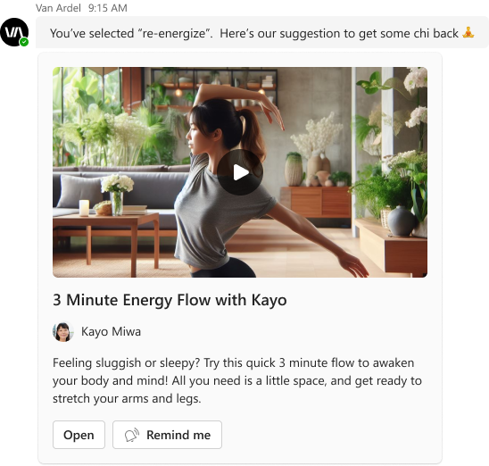
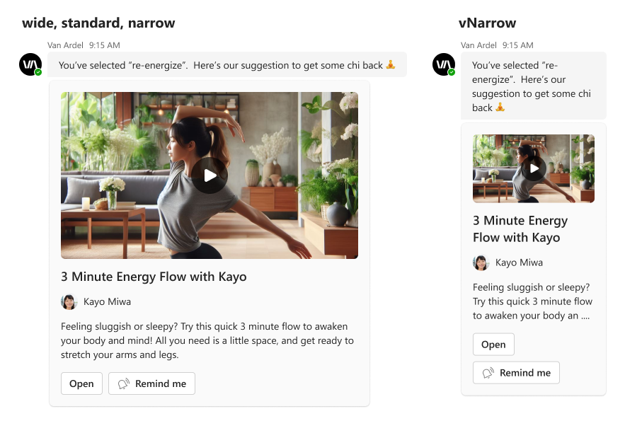

# Author Highlight Video

## Summary

Showcase your video content in style with the <b>Author Highlight Video Card</b>. Perfect for a variety of video types including tutorials, interviews, or creative showcases, this card is designed for customization. Add your titles, descriptions, and author info to create a personalized and engaging video experience.

_bot-sent_ card example:



## Compatibility


## Solution

Solution|Author(s)
--------|---------
Author Highlight Video | <a href="https://github.com/SuzanneTocco"></a> &nbsp; [Suz Tocco](https://github.com/SuzanneTocco) &nbsp;<a href="https://github.com/pabloas-ms"></a> &nbsp; [Pablo Vicente Astudillo Quintero](https://github.com/pabloas-ms) | Microsoft  

## Version history

Version|Date|Comments
-------|----|--------
1.0| April 11, 2024 | Initial release

### Disclaimer

***THIS CODE IS PROVIDED _AS IS_ WITHOUT WARRANTY OF ANY KIND, EITHER EXPRESS OR IMPLIED, INCLUDING ANY IMPLIED WARRANTIES OF FITNESS FOR A PARTICULAR PURPOSE, MERCHANTABILITY, OR NON-INFRINGEMENT.***

## Responsive Layouts

This card utilizes our responsive framework, allowing for multiple layouts or content modifications for specific set width ranges. For more details on coding with this framework, see <a href="https://learn.microsoft.com/en-us/microsoftteams/platform/task-modules-and-cards/cards/cards-format?tabs=adaptive-md%2Cdesktop%2Cconnector-html#adaptive-card-responsive-layout">Design responsive Adaptive Cards</a>.




## Adaptive Cards Designer Tool
<!--- button image exported at 1.2x --->
<a href="https://adaptivecards.io/designer?card=https%3A%2F%2Fraw.githubusercontent.com%2Fsuzto%2FStarterCards%2Fmain%2Fsamples%2Fauthor-highlight-video%2Fcard.json" target="_blank">
  
</a>

> [!NOTE]
> Responsive layout is not supported in the Designer.


<details closed>
<summary>
Click to see the card payload
</summary>

```json
{
  "type": "AdaptiveCard",
  "speak": "3 minute energy flow with kayo video",
  "$schema": "http://adaptivecards.io/schemas/adaptive-card.json",
  "version": "1.5",
  "body": [
    {
      "type": "Image",
      "url": "https://raw.githubusercontent.com/suzto/StarterCards/main/samples/author-highlight-video/assets/video_image.png",
      "altText": "3 Minute Energy Flow with Kayo Video"
    },
    {
      "type": "TextBlock",
      "text": "3 Minute Energy Flow with Kayo",
      "wrap": true,
      "size": "Large",
      "weight": "Bolder"
    },
    {
      "type": "ColumnSet",
      "columns": [
        {
          "type": "Column",
          "width": "auto",
          "items": [
            {
              "type": "Image",
              "url": "https://raw.githubusercontent.com/suzto/StarterCards/main/samples/author-highlight-video/assets/avatar.png",
              "width": "24px",
              "height": "24px",
              "style": "Person",
              "altText": "Avatar of Kayo Miwa"
            }
          ],
          "verticalContentAlignment": "Center"
        },
        {
          "type": "Column",
          "width": "stretch",
          "items": [
            {
              "type": "TextBlock",
              "text": "Kayo Miwa",
              "wrap": true
            }
          ],
          "spacing": "Small",
          "verticalContentAlignment": "Center"
        }
      ]
    },
    {
      "type": "TextBlock",
      "targetWidth": "atLeast:narrow",
      "text": "Feeling sluggish or sleepy? Try this quick 3 minute flow to awaken your body and mind! All you need is a little space, and get ready to stretch your arms and legs.",
      "wrap": true
    },
    {
      "type": "TextBlock",
      "targetWidth": "veryNarrow",
      "text": "Feeling sluggish or sleepy? Try this quick 3 minute flow to awaken your body and...",
      "wrap": true
    },
    {
      "type": "ActionSet",
      "actions": [
        {
          "type": "Action.OpenUrl",
          "title": "Open",
          "url": "https://adaptivecards.io/"
        },
        {
          "type": "Action.OpenUrl",
          "title": "Remind me",
          "url": "https://adaptivecards.io/",
          "iconUrl": "https://raw.githubusercontent.com/suzto/StarterCards/main/samples/author-highlight-video/assets/remind_icon.png"
        }
      ]
    }
  ]
}
```

</details>

