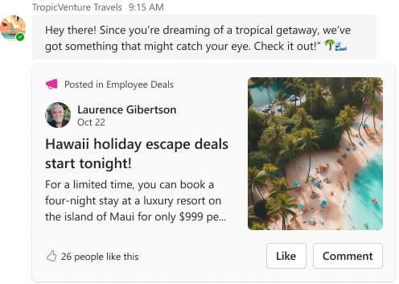

# Communication 

`need to update this page`



### Card Payload

````
{
  "type": "AdaptiveCard",
  "body": [
    {
      "columns": [
        {
          "width": "stretch",
          "items": [
            {
              "columns": [
                {
                  "width": "auto",
                  "items": [
                    {
                      "url": "https://raw.githubusercontent.com/suzto/StarterCards/main/samples/communication/assets/icon_megaphone.png",
                      "height": "auto",
                      "type": "Image",
                      "altText": "📢"
                    }
                  ],
                  "type": "Column"
                },
                {
                  "width": "stretch",
                  "items": [
                    {
                      "isSubtle": true,
                      "size": "small",
                      "text": "Posted in Employee Deals",
                      "wrap": true,
                      "type": "TextBlock"
                    }
                  ],
                  "spacing": "Small",
                  "type": "Column"
                }
              ],
              "type": "ColumnSet"
            },
            {
              "columns": [
                {
                  "width": "auto",
                  "items": [
                    {
                      "url": "https://raw.githubusercontent.com/suzto/StarterCards/main/samples/communication/assets/avatar.png",
                      "height": "auto",
                      "type": "Image",
                      "altText": "Avatar"
                    }
                  ],
                  "type": "Column"
                },
                {
                  "width": "stretch",
                  "items": [
                    {
                      "text": "Laurence Gibertson",
                      "weight": "bolder",
                      "wrap": true,
                      "type": "TextBlock"
                    },
                    {
                      "isSubtle": true,
                      "size": "small",
                      "text": "Oct 22",
                      "wrap": true,
                      "spacing": "None",
                      "type": "TextBlock"
                    }
                  ],
                  "type": "Column"
                }
              ],
              "type": "ColumnSet"
            },
            {
              "size": "large",
              "text": "Hawaii holiday escape deals start tonight!",
              "weight": "bolder",
              "wrap": true,
              "spacing": "Small",
              "type": "TextBlock"
            },
            {
              "text": "For a limited time, you can book a four night stay at luxury resort on the island of Maui for only $999 per person.",
              "wrap": true,
              "spacing": "Small",
              "type": "TextBlock",
              "maxLines": 3
            },
            {
              "columns": [
                {
                  "width": "auto",
                  "items": [
                    {
                      "horizontalAlignment": "right",
                      "url": "https://raw.githubusercontent.com/suzto/StarterCards/main/samples/communication/assets/icon_like_outline.png",
                      "height": "auto",
                      "id": "likeOutline",
                      "type": "Image",
                      "altText": "👍"
                    },
                    {
                      "horizontalAlignment": "right",
                      "url": "https://raw.githubusercontent.com/suzto/StarterCards/main/samples/communication/assets/icon_like_filled.png",
                      "height": "auto",
                      "id": "likeFilled",
                      "isVisible": false,
                      "type": "Image",
                      "altText": "👍"
                    }
                  ],
                  "verticalContentAlignment": "center",
                  "spacing": "None",
                  "type": "Column"
                },
                {
                  "width": "stretch",
                  "items": [
                    {
                      "size": "small",
                      "text": "26 people like this",
                      "wrap": true,
                      "id": "commentLike",
                      "type": "TextBlock"
                    },
                    {
                      "size": "small",
                      "text": "27 people like this",
                      "wrap": true,
                      "id": "commentUnlike",
                      "isVisible": false,
                      "type": "TextBlock"
                    }
                  ],
                  "verticalContentAlignment": "center",
                  "spacing": "Small",
                  "type": "Column"
                }
              ],
              "spacing": "ExtraLarge",
              "type": "ColumnSet"
            },
            {
              "targetWidth": "atMost:narrow",
              "actions": [
                {
                  "targetElements": [
                    "likeFilled",
                    "likeOutline",
                    "commentLike",
                    "commentUnlike"
                  ],
                  "title": "Like",
                  "type": "Action.ToggleVisibility"
                },
                {
                  "title": "Comment",
                  "type": "Action.Submit"
                }
              ],
              "spacing": "Medium",
              "type": "ActionSet"
            }
          ],
          "type": "Column"
        },
        {
          "width": "auto",
          "items": [
            {
              "url": "https://raw.githubusercontent.com/suzto/StarterCards/main/samples/communication/assets/hero_image.png",
              "width": "150px",
              "height": "auto",
              "type": "Image",
              "altText": "Beach Image"
            },
            {
              "targetWidth": "atLeast:standard",
              "actions": [
                {
                  "targetElements": [
                    "likeFilled",
                    "likeOutline",
                    "commentLike",
                    "commentUnlike"
                  ],
                  "title": "Like",
                  "type": "Action.ToggleVisibility"
                },
                {
                  "title": "Comment",
                  "type": "Action.Submit"
                }
              ],
              "spacing": "Medium",
              "type": "ActionSet"
            }
          ],
          "type": "Column"
        }
      ],
      "type": "ColumnSet"
    }
  ],
  "$schema": "http://adaptivecards.io/schemas/adaptive-card.json",
  "version": "1.5"
}
````