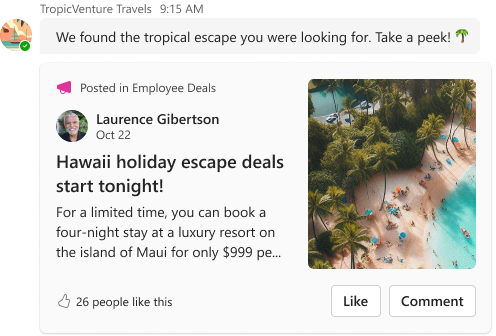
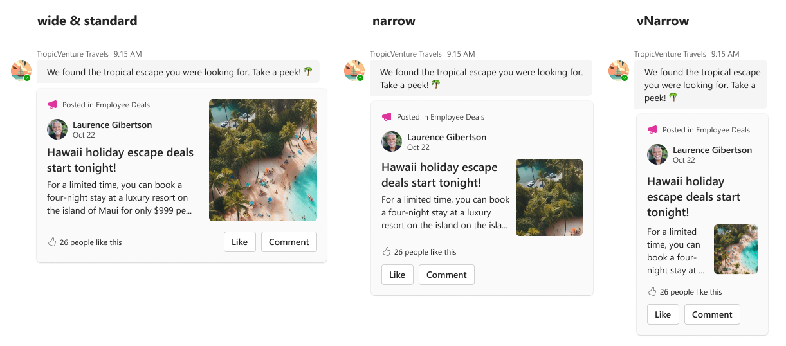

# Communications

## Summary

The <b>Communications Card</b> is your gateway to vibrant social connectivity. Ideal for broadcasting company updates, sharing posts, or fostering community ties, this card is versatile enough to match your messaging. Enrich it with custom text, imagery, and links for an immersive social journey.

_bot-sent_ card example:




## Compatibility


## Solution

Solution|Author(s)
--------|---------
Course Video | <a href="https://github.com/SuzanneTocco"></a> &nbsp; [Suz Tocco](https://github.com/SuzanneTocco) &nbsp;<a href="https://github.com/pabloas-ms"></a> &nbsp; [Pablo Vicente Astudillo Quintero](https://github.com/pabloas-ms) | Microsoft  

## Version history

Version|Date|Comments
-------|----|--------
1.0| April 11, 2024 | Initial release

### Disclaimer

***THIS CODE IS PROVIDED _AS IS_ WITHOUT WARRANTY OF ANY KIND, EITHER EXPRESS OR IMPLIED, INCLUDING ANY IMPLIED WARRANTIES OF FITNESS FOR A PARTICULAR PURPOSE, MERCHANTABILITY, OR NON-INFRINGEMENT.***

## Responsive Layouts

This card utilizes our responsive framework, allowing for multiple layouts or content modifications for specific set width ranges. For more details on coding with this framework, see <a href="https://learn.microsoft.com/en-us/microsoftteams/platform/task-modules-and-cards/cards/cards-format?tabs=adaptive-md%2Cdesktop%2Cconnector-html#adaptive-card-responsive-layout">Design responsive Adaptive Cards</a>.



## Inspiration Gallery

Below you'll find a few alternative expressions of the card.


<br> <br>


## 1) 👩‍🎨 Personalize This Card

### Step-by-step instructions and tips

#### 1) Copy the card JSON into the Designer Tool

Teams provides support for this tool, which is ideal for constructing and modifying cards. You can either copy the card payload provided below or use the <b>‘Open in Designer’</b> button to start working in the Designer platform.
<br>

 > [!NOTE]
> Responsive layout is not supported in the Designer.

<!--- dropdown --->

<details closed>
<summary>
Click to see the card payload
</summary>


```json
{
  "type": "AdaptiveCard",
  "speak": "Hawaii holiday escape deals start tonight",
  "body": [
    {
      "columns": [
        {
          "width": "auto",
          "items": [
            {
              "url": "https://raw.githubusercontent.com/suzto/StarterCards/main/samples/communication/assets/icon_megaphone.png",
              "height": "16px",
              "type": "Image",
              "altText": "Megaphone icon",
              "width": "16px"
            }
          ],
          "type": "Column"
        },
        {
          "width": "stretch",
          "items": [
            {
              "isSubtle": true,
              "size": "Small",
              "text": "Posted in Employee Deals",
              "wrap": true,
              "type": "TextBlock"
            }
          ],
          "spacing": "Small",
          "type": "Column"
        }
      ],
      "type": "ColumnSet",
      "targetWidth": "narrow"
    },
    {
      "columns": [
        {
          "width": "auto",
          "items": [
            {
              "url": "https://raw.githubusercontent.com/suzto/StarterCards/main/samples/communication/assets/avatar.png",
              "height": "auto",
              "type": "Image",
              "altText": "Avatar of Laurence Gibertson"
            }
          ],
          "type": "Column"
        },
        {
          "width": "stretch",
          "items": [
            {
              "text": "Laurence Gibertson",
              "weight": "Bolder",
              "wrap": true,
              "type": "TextBlock"
            },
            {
              "isSubtle": true,
              "size": "Small",
              "text": "Oct 22",
              "wrap": true,
              "spacing": "None",
              "type": "TextBlock"
            }
          ],
          "type": "Column"
        }
      ],
      "type": "ColumnSet",
      "targetWidth": "narrow"
    },
    {
      "columns": [
        {
          "width": "stretch",
          "items": [
            {
              "columns": [
                {
                  "width": "auto",
                  "items": [
                    {
                      "url": "https://raw.githubusercontent.com/suzto/StarterCards/main/samples/communication/assets/icon_megaphone.png",
                      "height": "16px",
                      "type": "Image",
                      "altText": "Megaphone icon",
                      "width": "16px"
                    }
                  ],
                  "type": "Column"
                },
                {
                  "width": "stretch",
                  "items": [
                    {
                      "isSubtle": true,
                      "size": "Small",
                      "text": "Posted in Employee Deals",
                      "wrap": true,
                      "type": "TextBlock"
                    }
                  ],
                  "spacing": "Small",
                  "type": "Column"
                }
              ],
              "targetWidth": "atLeast:standard",
              "type": "ColumnSet"
            },
            {
              "columns": [
                {
                  "width": "auto",
                  "items": [
                    {
                      "url": "https://raw.githubusercontent.com/suzto/StarterCards/main/samples/communication/assets/avatar.png",
                      "height": "auto",
                      "type": "Image",
                      "altText": "Avatar of Laurence Gibertson"
                    }
                  ],
                  "type": "Column"
                },
                {
                  "width": "stretch",
                  "items": [
                    {
                      "text": "Laurence Gibertson",
                      "weight": "Bolder",
                      "wrap": true,
                      "type": "TextBlock"
                    },
                    {
                      "isSubtle": true,
                      "size": "Small",
                      "text": "Oct 22",
                      "wrap": true,
                      "spacing": "None",
                      "type": "TextBlock"
                    }
                  ],
                  "type": "Column"
                }
              ],
              "targetWidth": "atLeast:standard",
              "type": "ColumnSet"
            },
            {
              "size": "Large",
              "text": "Hawaii holiday escape deals start tonight!",
              "weight": "Bolder",
              "wrap": true,
              "spacing": "Small",
              "type": "TextBlock"
            },
            {
              "text": "For a limited time, you can book a four night stay at luxury resort on the island of Maui for only $999 per person.",
              "wrap": true,
              "spacing": "Small",
              "type": "TextBlock",
              "maxLines": 3
            },
            {
              "columns": [
                {
                  "width": "auto",
                  "items": [
                    {
                      "horizontalAlignment": "Right",
                      "url": "https://raw.githubusercontent.com/suzto/StarterCards/main/samples/communication/assets/icon_like_outline.png",
                      "width": "16px",
                      "height": "16px",
                      "id": "likeOutline",
                      "type": "Image",
                      "altText": "Outlined thumbs up"
                    },
                    {
                      "horizontalAlignment": "Right",
                      "url": "https://raw.githubusercontent.com/suzto/StarterCards/main/samples/communication/assets/icon_like_filled.png",
                      "width": "16px",
                      "height": "16px",
                      "id": "likeFilled",
                      "isVisible": false,
                      "type": "Image",
                      "altText": "Thumbs up"
                    }
                  ],
                  "verticalContentAlignment": "Bottom",
                  "spacing": "None",
                  "type": "Column"
                },
                {
                  "width": "stretch",
                  "items": [
                    {
                      "size": "Small",
                      "text": "26 people like this",
                      "wrap": true,
                      "id": "commentLike",
                      "type": "TextBlock"
                    },
                    {
                      "size": "Small",
                      "text": "27 people like this",
                      "wrap": true,
                      "id": "commentUnlike",
                      "isVisible": false,
                      "type": "TextBlock"
                    }
                  ],
                  "verticalContentAlignment": "Bottom",
                  "spacing": "Small",
                  "type": "Column"
                }
              ],
              "height": "stretch",
              "spacing": "ExtraLarge",
              "type": "ColumnSet"
            },
            {
              "targetWidth": "atMost:narrow",
              "actions": [
                {
                  "targetElements": [
                    "likeFilled",
                    "likeOutline",
                    "commentLike",
                    "commentUnlike",
                    "likeFilled2",
                    "likeOutline2",
                    "commentLike2",
                    "commentUnlike2"
                  ],
                  "title": "Like",
                  "type": "Action.ToggleVisibility"
                },
                {
                  "title": "Comment",
                  "type": "Action.Submit"
                }
              ],
              "spacing": "Medium",
              "type": "ActionSet"
            }
          ],
          "type": "Column"
        },
        {
          "width": "auto",
          "items": [
            {
              "targetWidth": "atLeast:standard",
              "url": "https://raw.githubusercontent.com/suzto/StarterCards/main/samples/communication/assets/hero_image.png",
              "width": "150px",
              "height": "auto",
              "type": "Image",
              "altText": "Beach Image"
            },
            {
              "targetWidth": "narrow",
              "url": "https://raw.githubusercontent.com/suzto/StarterCards/main/samples/communication/assets/hero_image.png",
              "width": "100px",
              "height": "auto",
              "type": "Image",
              "altText": "Beach Image"
            },
            {
              "targetWidth": "atLeast:standard",
              "actions": [
                {
                  "targetElements": [
                    "likeFilled",
                    "likeOutline",
                    "commentLike",
                    "commentUnlike",
                    "likeFilled2",
                    "likeOutline2",
                    "commentLike2",
                    "commentUnlike2"
                  ],
                  "title": "Like",
                  "type": "Action.ToggleVisibility"
                },
                {
                  "title": "Comment",
                  "type": "Action.Submit"
                }
              ],
              "spacing": "Medium",
              "type": "ActionSet"
            }
          ],
          "type": "Column"
        }
      ],
      "type": "ColumnSet",
      "targetWidth": "atLeast:narrow"
    },
    {
      "type": "Container",
      "targetWidth": "veryNarrow",
      "items": [
        {
          "columns": [
            {
              "width": "auto",
              "items": [
                {
                  "url": "https://raw.githubusercontent.com/suzto/StarterCards/main/samples/communication/assets/icon_megaphone.png",
                  "height": "16px",
                  "type": "Image",
                  "altText": "Megaphone icon",
                  "width": "16px"
                }
              ],
              "type": "Column"
            },
            {
              "width": "stretch",
              "items": [
                {
                  "isSubtle": true,
                  "size": "Small",
                  "text": "Posted in Employee Deals",
                  "wrap": true,
                  "type": "TextBlock"
                }
              ],
              "spacing": "Small",
              "type": "Column"
            }
          ],
          "type": "ColumnSet"
        },
        {
          "columns": [
            {
              "width": "auto",
              "items": [
                {
                  "url": "https://raw.githubusercontent.com/suzto/StarterCards/main/samples/communication/assets/avatar.png",
                  "height": "auto",
                  "type": "Image",
                  "altText": "Avatar of Laurence Gibertson"
                }
              ],
              "type": "Column"
            },
            {
              "width": "stretch",
              "items": [
                {
                  "text": "Laurence Gibertson",
                  "weight": "Bolder",
                  "wrap": true,
                  "type": "TextBlock"
                },
                {
                  "isSubtle": true,
                  "size": "Small",
                  "text": "Oct 22",
                  "wrap": true,
                  "spacing": "None",
                  "type": "TextBlock"
                }
              ],
              "type": "Column"
            }
          ],
          "type": "ColumnSet"
        },
        {
          "size": "Large",
          "text": "Hawaii holiday escape deals start tonight!",
          "weight": "Bolder",
          "wrap": true,
          "spacing": "Small",
          "type": "TextBlock"
        },
        {
          "columns": [
            {
              "width": "stretch",
              "items": [
                {
                  "maxLines": 4,
                  "text": "For a limited time, you can book a four night stay at luxury resort on the island of Maui for only $999 per person.",
                  "wrap": true,
                  "spacing": "Small",
                  "type": "TextBlock"
                }
              ],
              "type": "Column"
            },
            {
              "width": "auto",
              "items": [
                {
                  "url": "https://raw.githubusercontent.com/suzto/StarterCards/main/samples/communication/assets/hero_image.png",
                  "width": "60px",
                  "type": "Image"
                }
              ],
              "type": "Column"
            }
          ],
          "type": "ColumnSet"
        },
        {
          "columns": [
            {
              "width": "auto",
              "items": [
                {
                  "horizontalAlignment": "Right",
                  "url": "https://raw.githubusercontent.com/suzto/StarterCards/main/samples/communication/assets/icon_like_outline.png",
                  "width": "16px",
                  "height": "16px",
                  "id": "likeOutline2",
                  "type": "Image",
                  "altText": "Outlined thumbs up"
                },
                {
                  "horizontalAlignment": "Right",
                  "url": "https://raw.githubusercontent.com/suzto/StarterCards/main/samples/communication/assets/icon_like_filled.png",
                  "width": "16px",
                  "height": "16px",
                  "id": "likeFilled2",
                  "isVisible": false,
                  "type": "Image",
                  "altText": "Thumbs up"
                }
              ],
              "verticalContentAlignment": "Center",
              "spacing": "None",
              "type": "Column"
            },
            {
              "width": "stretch",
              "items": [
                {
                  "size": "Small",
                  "text": "26 people like this",
                  "wrap": true,
                  "id": "commentLike2",
                  "type": "TextBlock"
                },
                {
                  "size": "Small",
                  "text": "27 people like this",
                  "wrap": true,
                  "id": "commentUnlike2",
                  "isVisible": false,
                  "type": "TextBlock"
                }
              ],
              "verticalContentAlignment": "Center",
              "spacing": "Small",
              "type": "Column"
            }
          ],
          "spacing": "ExtraLarge",
          "type": "ColumnSet"
        },
        {
          "actions": [
            {
              "targetElements": [
                "likeFilled",
                "likeOutline",
                "commentLike",
                "commentUnlike",
                "likeFilled2",
                "likeOutline2",
                "commentLike2",
                "commentUnlike2"
              ],
              "title": "Like",
              "type": "Action.ToggleVisibility"
            },
            {
              "title": "Comment",
              "type": "Action.Submit"
            }
          ],
          "spacing": "Medium",
          "type": "ActionSet"
        }
      ]
    }
  ],
  "$schema": "http://adaptivecards.io/schemas/adaptive-card.json",
  "version": "1.5"
}
```

</details>

*To create a "full width" card, add the following code to the JSON.* <br>

```json
"msTeams": {
    "width": "full"
  },
```


<a href="https://adaptivecards.io/designer?card=https%3A%2F%2Fraw.githubusercontent.com%2Fsuzto%2FStarterCards%2Fmain%2Fsamples%2Fcommunication%2Fcard.json" target="_blank">
  
</a>

 <br>


#### 2) Replace the Hero Image

If you’re creating an image, save the image as a transparent PNG at 2x size to ensure good resolution across endpoints. Keep the image slightly taller vertically to leave ample room for the copy.
* <b>Note:</b> A radius feature for adding rounded corners to the image is coming soon. In the meantime, you can manually add a 6px radius to the corners.

#### 3) Ensure the avatar image is correctly linked
Connect the image URL so that it retrieves/displays the message author’s image.

#### 4) Update the description copy and set truncation
Set the maximum line truncation as desired to work for the card content and layout. You can also choose to add a “Show more” / “Show less” feature.

#### 5) Update Button Copy and Actions

Customize button text and actions to suit your needs. <br>
For icons, use the color #818181 to ensure readability in light/dark modes. Icons should fit edge-to-edge in a 16x16 square. Save them as transparent PNGs at 2x size for good resolution across endpoints. Access Fluent icon asset links in the [Resources section](#resources--tools) on this page.

<br>

***For further design modifications** use the Microsoft Teams UI Kit in Figma to create, visualize, spec <a href="assets/video_spec.png">(see current card spec)</a> , and verify the layouts before coding.<br />

<a href="https://www.figma.com/community/file/916836509871353159">

</a>

<br>

## 2) 🚗 Test your card

This is where the rubber meets the road to ensure high quality cards for all users across all endpoints. Road test your cards considering the following:

* <b>Themes:</b> Light Mode, Dark Mode, High Contrast
* <b>Common widths:</b> Chat, Channel, Meeting Chat, Phone (iOS- Portrait/landscape, Android-Portrait/landscape), Tablet (iOS- Portrait/landscape, Android-Portrait/landscape)
* <b>Accessibility:</b> Color contrast if creating new visuals, tabbing with keyboard or mobile equivelents, Voice assistance (readers to read card content)

<br>

## Resources & Tools ##

* **Learn**: For complete details on how to design and build adaptive cards for your Teams app, visit the Microsoft Teams Learn website pages on  [Design Adaptive Cards for Your Teams App](https://learn.microsoft.com/en-us/microsoftteams/platform/task-modules-and-cards/cards/design-effective-cards?tabs=design) and [Build Cards](https://learn.microsoft.com/en-us/microsoftteams/platform/task-modules-and-cards/what-are-cards) (You can use the [schema explorer](https://adaptivecards.io/explorer/) to learn about the structure and options of each element.

* **Design**: Our tools can help you learn Teams patterns and design apps and cards.

  * Design Teams apps and cards with the [The Microsoft Teams UI Kit](https://www.figma.com/community/file/916836509871353159), which has core components, templates, and best practices.
  * Find Microsoft icons from [IconCloud](https://iconcloud.design/browse/Fluent%20System%20Library/Fluent%20Regular) or the [Fluent 2 Iconography site](https://fluent2.microsoft.design/iconography) and modify them to to use in your cards (you'll need to save them out as pngs while we work on building in Fluent icon support).

* **Build**: Edit, build, preview, and test cards with our Teams Development Portal [Adaptive Card Designer](https://dev.teams.microsoft.com/cards).

</p>

## Contribute ##

Refer to the [contribution docs](/CONTRIBUTE.md) for more information.

## Help

We do not support samples, but we this community is always willing to help, and we want to improve these samples. We use GitHub to track issues, which makes it easy for  community members to volunteer their time and help resolve issues.

You can try looking at [issues related to this sample](https://github.com/pnp/AdaptiveCards-Templates/issues) to see if anybody else is having the same issues.
