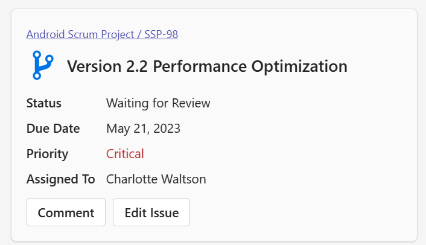
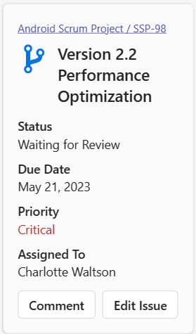

# Issue

### Wide / Standard / Narrow



### Very Narrow



### Card payload

````
{
  "type": "AdaptiveCard",
  "body": [
    {
      "inlines": [
        {
          "type": "TextRun",
          "size": "Small",
          "text": "Android Scrum Project / SSP-98",
          "selectAction": {
            "url": "https://adaptivecards.io",
            "type": "Action.OpenUrl"
          }
        }
      ],
      "type": "RichTextBlock"
    },
    {
      "columns": [
        {
          "width": "auto",
          "items": [
            {
              "url": "data:image/svg+xml,%3Csvg xmlns='http://www.w3.org/2000/svg' fill='%23000000' width='800px' height='800px' viewBox='0 0 512 512' style='&amp;%2310;'%3E%3Ctitle%3Eionicons-v5-d%3C/title%3E%3Cpath d='M416,160a64,64,0,1,0-96.27,55.24c-2.29,29.08-20.08,37-75,48.42-17.76,3.68-35.93,7.45-52.71,13.93V151.39a64,64,0,1,0-64,0V360.61a64,64,0,1,0,64.42.24c2.39-18,16-24.33,65.26-34.52,27.43-5.67,55.78-11.54,79.78-26.95,29-18.58,44.53-46.78,46.36-83.89A64,64,0,0,0,416,160ZM160,64a32,32,0,1,1-32,32A32,32,0,0,1,160,64Zm0,384a32,32,0,1,1,32-32A32,32,0,0,1,160,448ZM352,192a32,32,0,1,1,32-32A32,32,0,0,1,352,192Z' fill='%230073e6'/%3E%3C/svg%3E",
              "width": "37px",
              "height": "auto",
              "type": "Image"
            }
          ],
          "type": "Column"
        },
        {
          "width": "stretch",
          "items": [
            {
              "size": "Large",
              "text": "Version 2.2 Performance Optimization",
              "weight": "Bolder",
              "wrap": true,
              "type": "TextBlock"
            }
          ],
          "verticalContentAlignment": "Center",
          "spacing": "Small",
          "type": "Column"
        }
      ],
      "spacing": "Small",
      "type": "ColumnSet"
    },
    {
      "targetWidth": "atLeast:narrow",
      "columns": [
        {
          "width": "auto",
          "items": [
            {
              "text": "Status",
              "weight": "bolder",
              "wrap": true,
              "type": "TextBlock"
            },
            {
              "text": "Due Date",
              "weight": "bolder",
              "wrap": true,
              "spacing": "Small",
              "type": "TextBlock"
            },
            {
              "text": "Priority",
              "weight": "bolder",
              "wrap": true,
              "spacing": "Small",
              "type": "TextBlock"
            },
            {
              "text": "Assigned To",
              "weight": "bolder",
              "wrap": true,
              "spacing": "Small",
              "type": "TextBlock"
            }
          ],
          "type": "Column"
        },
        {
          "width": "stretch",
          "items": [
            {
              "text": "Waiting for Review",
              "wrap": true,
              "type": "TextBlock"
            },
            {
              "text": "May 21, 2023",
              "wrap": true,
              "spacing": "Small",
              "type": "TextBlock"
            },
            {
              "color": "attention",
              "text": "Critical",
              "wrap": true,
              "spacing": "Small",
              "type": "TextBlock"
            },
            {
              "text": "Charlotte Waltson",
              "wrap": true,
              "spacing": "Small",
              "type": "TextBlock"
            }
          ],
          "type": "Column"
        }
      ],
      "type": "ColumnSet"
    },
    {
      "text": "Status",
      "weight": "Bolder",
      "wrap": true,
      "type": "TextBlock",
      "targetWidth": "veryNarrow"
    },
    {
      "text": "Waiting for Review",
      "wrap": true,
      "type": "TextBlock",
      "spacing": "None",
      "targetWidth": "veryNarrow"
    },
    {
      "text": "Due Date",
      "weight": "Bolder",
      "wrap": true,
      "spacing": "Small",
      "type": "TextBlock",
      "targetWidth": "veryNarrow"
    },
    {
      "text": "May 21, 2023",
      "wrap": true,
      "spacing": "None",
      "type": "TextBlock",
      "targetWidth": "veryNarrow"
    },
    {
      "text": "Priority",
      "weight": "Bolder",
      "wrap": true,
      "spacing": "Small",
      "type": "TextBlock",
      "targetWidth": "veryNarrow"
    },
    {
      "color": "Attention",
      "text": "Critical",
      "wrap": true,
      "spacing": "None",
      "type": "TextBlock",
      "targetWidth": "veryNarrow"
    },
    {
      "text": "Assigned To",
      "weight": "Bolder",
      "wrap": true,
      "spacing": "Small",
      "type": "TextBlock",
      "targetWidth": "veryNarrow"
    },
    {
      "text": "Charlotte Waltson",
      "wrap": true,
      "spacing": "None",
      "type": "TextBlock",
      "targetWidth": "veryNarrow"
    },
    {
      "actions": [
        {
          "title": "Comment",
          "type": "Action.OpenUrl"
        },
        {
          "title": "Edit Issue",
          "type": "Action.OpenUrl"
        }
      ],
      "type": "ActionSet"
    }
  ],
  "$schema": "http://adaptivecards.io/schemas/adaptive-card.json",
  "version": "1.5"
}
````