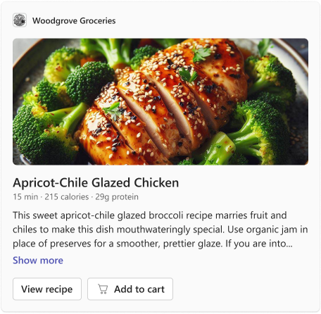
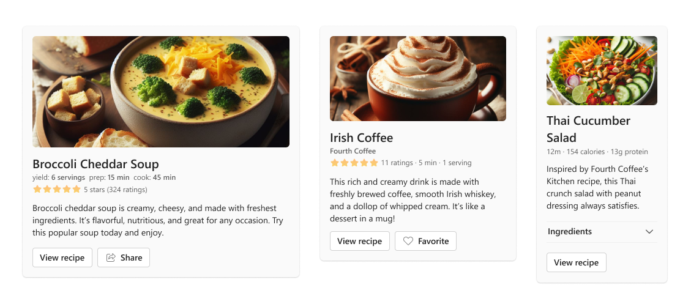

# Recipe


## Summary

Draw in your audience with the <b>Recipe Card</b> (AKA _Hero Showcase Card_), where a <b>captivating image</b> sets the stage for your featured content. Whether it’s a <b>recipe</b> or a <b>special feature</b>, users can expand the card to uncover the full story at their leisure.

_user-sent_ card example:



## Compatibility


## Solution

Solution|Author(s)
--------|---------
recipe | <a href="https://github.com/SuzanneTocco"></a> &nbsp; [Suz Tocco](https://github.com/SuzanneTocco) \| Microsoft  

## Version history

Version|Date|Comments
-------|----|--------
1.0| October 31, 2023 | Initial release

## Disclaimer

**THIS CODE IS PROVIDED *AS IS* WITHOUT WARRANTY OF ANY KIND, EITHER EXPRESS OR IMPLIED, INCLUDING ANY IMPLIED WARRANTIES OF FITNESS FOR A PARTICULAR PURPOSE, MERCHANTABILITY, OR NON-INFRINGEMENT.**

## Inspiration Gallery

Below you'll find a few alternative expressions of the card.



<br><br>

## 1) 👩‍🎨 Personalize This Card

We designed this card for Teams app partners who need to support your use case. This card type has a unique visual and interaction pattern to ensure a consistent user experience. To make this card suit your needs, simply adjust the text, images, and actions.

**To modify or extend this card** <a href="assets/design_spec.png">(design spec)</a>, use the Microsoft Teams UI Kit to fine tune your design before coding.<br />

<a href="https://www.figma.com/community/file/916836509871353159">

</a>

### Step by step instructions and tips

#### 1) Open in the Microsoft Teams Designer Editing tool

Teams provides support for this tool, which is ideal for constructing and modifying cards. Copy the [card](card.json) payload and click on the <b>‘Open in Designer’</b> button to start working in the Designer platform.

> [!NOTE]
> Responsive layout is not supported in the Designer.

*To create a "full width" card, add the following code to the JSON.* <br>

```json
"msTeams": {
  "width": "full"
}
```
  


