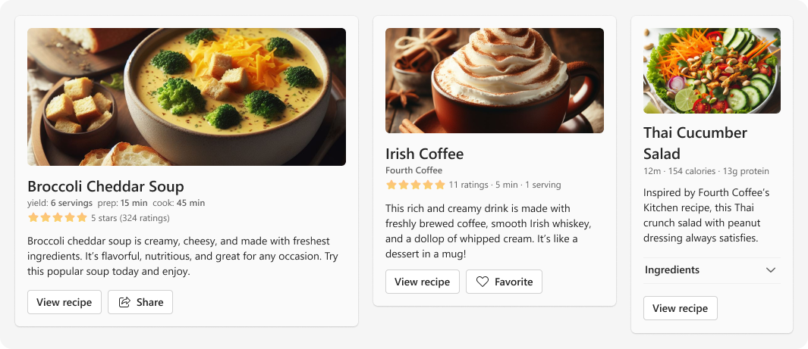

# Recipe

## Summary

Information about card design and usage goes here. Cupcake toffee lemon drops donut caramels cookie. Bonbon topping tart cupcake jelly beans pie liquorice cake. Gummies wafer danish macaroon muffin cupcake cheesecake tart macaroon. Jujubes chocolate bar caramels lemon drops cookie. Sugar plum bonbon jelly jujubes lollipop. 

`Example: sent from person`

 
## Compatibility

## Adaptive Cards Designer Tool
<!--- button image exported at 1.2x --->

    

## Solution

Solution|Author(s)
--------|---------
recipe |  &nbsp; [Suz Tocco](https://github.com/SuzanneTocco) \| Microsoft  

 
## Version history

Version|Date|Comments
-------|----|--------
1.0| October 31, 2023 | Initial release

## Disclaimer
**THIS CODE IS PROVIDED *AS IS* WITHOUT WARRANTY OF ANY KIND, EITHER EXPRESS OR IMPLIED, INCLUDING ANY IMPLIED WARRANTIES OF FITNESS FOR A PARTICULAR PURPOSE, MERCHANTABILITY, OR NON-INFRINGEMENT.**

## Variations

Information here about typical modifications that are reasonable to this card.

## Customize Your Card

We designed this card for Teams app partners who need to support your use case. This card type has a unique visual and interaction pattern to ensure a consistent user experience.

> To customize or extend this card <a href="assets/recipe_design_spec.png">(design spec)</a>, use the Microsoft Teams UI Kit to fine tune your design.

 

#### To use the Adaptive Card Designer to customize this card, follow these steps: ####

Open Card in Designer

One- Instructions go here

 `Hello This is a code`

    
          
#### Next item ####
- **One** - Insructions go here
- **Two** - Insructions go here about what to do next

 ##  Test Drive Your Card: ##
Info here on how to send card to self and where to test it (desk, mobile). Also checking for how things scale in meeting chat. Basic checklist to cover. Scenarios, light/dark mode

## Resources & Tools: ##

## Contribute: ##
[Refer to the contribution docs for more information](http://www.google.fr/ "contribution docs")

## Help

