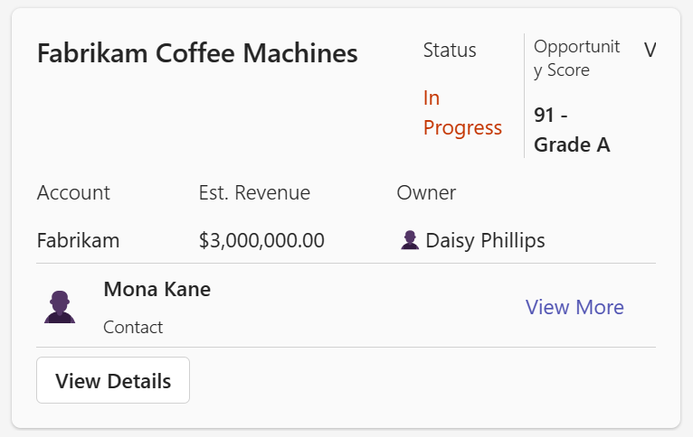
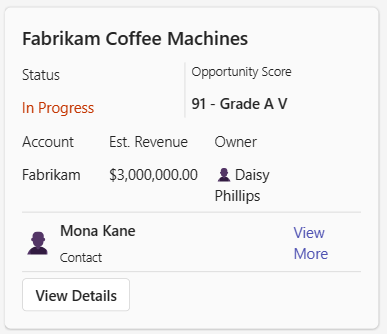

# Ticket

### Wide / Standard



### Narrow



### Card payload

````
{
  "type": "AdaptiveCard",
  "$schema": "http://adaptivecards.io/schemas/adaptive-card.json",
  "version": "1.5",
  "body": [
    {
      "targetWidth": "atLeast:standard",
      "type": "ColumnSet",
      "columns": [
        {
          "type": "Column",
          "width": 60,
          "items": [
            {
              "type": "TextBlock",
              "text": "Fabrikam Coffee Machines",
              "wrap": true,
              "size": "Large",
              "weight": "Bolder"
            }
          ]
        },
        {
          "type": "Column",
          "width": 15,
          "items": [
            {
              "type": "TextBlock",
              "text": "Status",
              "wrap": true,
              "size": "Medium",
              "weight": "Lighter"
            },
            {
              "type": "TextBlock",
              "text": "In Progress",
              "wrap": true,
              "color": "Warning"
            }
          ]
        },
        {
          "type": "Column",
          "width": 18,
          "separator": true,
          "items": [
            {
              "type": "TextBlock",
              "text": "Opportunity Score",
              "wrap": true,
              "size": "Small",
              "weight": "Lighter"
            },
            {
              "type": "TextBlock",
              "text": "91 - Grade A",
              "wrap": true,
              "weight": "Bolder"
            }
          ]
        },
        {
          "type": "Column",
          "width": "auto",
          "items": [
            {
              "type": "TextBlock",
              "text": "V",
              "wrap": true
            }
          ]
        }
      ]
    },
    {
      "targetWidth": "narrow",
      "type": "TextBlock",
      "text": "Fabrikam Coffee Machines",
      "wrap": true,
      "size": "Large",
      "weight": "Bolder"
    },
    {
      "targetWidth": "narrow",
      "type": "ColumnSet",
      "columns": [
        {
          "type": "Column",
          "width": 15,
          "items": [
            {
              "type": "TextBlock",
              "text": "Status",
              "wrap": true,
              "size": "Medium",
              "weight": "Lighter"
            },
            {
              "type": "TextBlock",
              "text": "In Progress",
              "wrap": true,
              "color": "Warning"
            }
          ]
        },
        {
          "type": "Column",
          "width": 15,
          "separator": true,
          "items": [
            {
              "type": "TextBlock",
              "text": "Opportunity Score",
              "wrap": true,
              "size": "Small",
              "weight": "Lighter"
            },
            {
              "type": "TextBlock",
              "text": "91 - Grade A  V",
              "wrap": true,
              "weight": "Bolder"
            }
          ]
        },
        {
          "type": "Column",
          "width": "auto"
        }
      ]
    },
    {
      "type": "ColumnSet",
      "columns": [
        {
          "type": "Column",
          "width": 20,
          "items": [
            {
              "type": "TextBlock",
              "text": "Account",
              "wrap": true,
              "weight": "Lighter"
            },
            {
              "type": "TextBlock",
              "text": "Fabrikam",
              "wrap": true
            }
          ]
        },
        {
          "type": "Column",
          "width": 25,
          "items": [
            {
              "type": "TextBlock",
              "text": "Est. Revenue",
              "wrap": true,
              "weight": "Lighter"
            },
            {
              "type": "TextBlock",
              "text": "$3,000,000.00",
              "wrap": true
            }
          ]
        },
        {
          "type": "Column",
          "width": 25,
          "items": [
            {
              "type": "TextBlock",
              "text": "Owner",
              "wrap": true,
              "weight": "Lighter"
            },
            {
              "type": "TextBlock",
              "text": "👤Daisy Phillips",
              "wrap": true
            }
          ]
        },
        {
          "type": "Column",
          "width": "stretch"
        }
      ]
    },
    {
      "type": "ColumnSet",
      "separator": true,
      "columns": [
        {
          "type": "Column",
          "width": 3,
          "items": [
            {
              "type": "TextBlock",
              "text": "👤",
              "wrap": true,
              "size": "ExtraLarge"
            }
          ],
          "verticalContentAlignment": "Center"
        },
        {
          "type": "Column",
          "width": 20,
          "items": [
            {
              "type": "TextBlock",
              "text": "Mona Kane",
              "wrap": true,
              "weight": "Bolder"
            },
            {
              "type": "TextBlock",
              "text": "Contact",
              "wrap": true,
              "spacing": "Small",
              "size": "Small",
              "weight": "Lighter"
            }
          ],
          "verticalContentAlignment": "Center"
        },
        {
          "type": "Column",
          "width": "stretch"
        },
        {
          "type": "Column",
          "width": 8,
          "items": [
            {
              "type": "TextBlock",
              "text": "View More",
              "wrap": true,
              "color": "Accent"
            }
          ],
          "verticalContentAlignment": "Center"
        }
      ]
    },
    {
      "type": "ActionSet",
      "separator": true,
      "actions": [
        {
          "type": "Action.OpenUrl",
          "title": "View Details",
          "url": "https://adaptivecards.io/"
        }
      ]
    }
  ]
}
````

### Full width Card payload

````
{
  "type": "AdaptiveCard",
  "$schema": "http://adaptivecards.io/schemas/adaptive-card.json",
  "version": "1.5",
  "msTeams": {
    "width": "full"
  },
  "body": [
    {
      "targetWidth": "atLeast:standard",
      "type": "ColumnSet",
      "columns": [
        {
          "type": "Column",
          "width": 60,
          "items": [
            {
              "type": "TextBlock",
              "text": "Fabrikam Coffee Machines",
              "wrap": true,
              "size": "Large",
              "weight": "Bolder"
            }
          ]
        },
        {
          "type": "Column",
          "width": 15,
          "items": [
            {
              "type": "TextBlock",
              "text": "Status",
              "wrap": true,
              "size": "Medium",
              "weight": "Lighter"
            },
            {
              "type": "TextBlock",
              "text": "In Progress",
              "wrap": true,
              "color": "Warning"
            }
          ]
        },
        {
          "type": "Column",
          "width": 18,
          "separator": true,
          "items": [
            {
              "type": "TextBlock",
              "text": "Opportunity Score",
              "wrap": true,
              "size": "Small",
              "weight": "Lighter"
            },
            {
              "type": "TextBlock",
              "text": "91 - Grade A",
              "wrap": true,
              "weight": "Bolder"
            }
          ]
        },
        {
          "type": "Column",
          "width": "auto",
          "items": [
            {
              "type": "TextBlock",
              "text": "V",
              "wrap": true
            }
          ]
        }
      ]
    },
    {
      "targetWidth": "narrow",
      "type": "TextBlock",
      "text": "Fabrikam Coffee Machines",
      "wrap": true,
      "size": "Large",
      "weight": "Bolder"
    },
    {
      "targetWidth": "narrow",
      "type": "ColumnSet",
      "columns": [
        {
          "type": "Column",
          "width": 15,
          "items": [
            {
              "type": "TextBlock",
              "text": "Status",
              "wrap": true,
              "size": "Medium",
              "weight": "Lighter"
            },
            {
              "type": "TextBlock",
              "text": "In Progress",
              "wrap": true,
              "color": "Warning"
            }
          ]
        },
        {
          "type": "Column",
          "width": 15,
          "separator": true,
          "items": [
            {
              "type": "TextBlock",
              "text": "Opportunity Score",
              "wrap": true,
              "size": "Small",
              "weight": "Lighter"
            },
            {
              "type": "TextBlock",
              "text": "91 - Grade A  V",
              "wrap": true,
              "weight": "Bolder"
            }
          ]
        },
        {
          "type": "Column",
          "width": "auto"
        }
      ]
    },
    {
      "type": "ColumnSet",
      "columns": [
        {
          "type": "Column",
          "width": 20,
          "items": [
            {
              "type": "TextBlock",
              "text": "Account",
              "wrap": true,
              "weight": "Lighter"
            },
            {
              "type": "TextBlock",
              "text": "Fabrikam",
              "wrap": true
            }
          ]
        },
        {
          "type": "Column",
          "width": 25,
          "items": [
            {
              "type": "TextBlock",
              "text": "Est. Revenue",
              "wrap": true,
              "weight": "Lighter"
            },
            {
              "type": "TextBlock",
              "text": "$3,000,000.00",
              "wrap": true
            }
          ]
        },
        {
          "type": "Column",
          "width": 25,
          "items": [
            {
              "type": "TextBlock",
              "text": "Owner",
              "wrap": true,
              "weight": "Lighter"
            },
            {
              "type": "TextBlock",
              "text": "👤Daisy Phillips",
              "wrap": true
            }
          ]
        },
        {
          "type": "Column",
          "width": "stretch"
        }
      ]
    },
    {
      "type": "ColumnSet",
      "separator": true,
      "columns": [
        {
          "type": "Column",
          "width": 3,
          "items": [
            {
              "type": "TextBlock",
              "text": "👤",
              "wrap": true,
              "size": "ExtraLarge"
            }
          ],
          "verticalContentAlignment": "Center"
        },
        {
          "type": "Column",
          "width": 20,
          "items": [
            {
              "type": "TextBlock",
              "text": "Mona Kane",
              "wrap": true,
              "weight": "Bolder"
            },
            {
              "type": "TextBlock",
              "text": "Contact",
              "wrap": true,
              "spacing": "Small",
              "size": "Small",
              "weight": "Lighter"
            }
          ],
          "verticalContentAlignment": "Center"
        },
        {
          "type": "Column",
          "width": "stretch"
        },
        {
          "type": "Column",
          "width": 8,
          "items": [
            {
              "type": "TextBlock",
              "text": "View More",
              "wrap": true,
              "color": "Accent"
            }
          ],
          "verticalContentAlignment": "Center"
        }
      ]
    },
    {
      "type": "ActionSet",
      "separator": true,
      "actions": [
        {
          "type": "Action.OpenUrl",
          "title": "View Details",
          "url": "https://adaptivecards.io/"
        }
      ]
    }
  ]
}
````