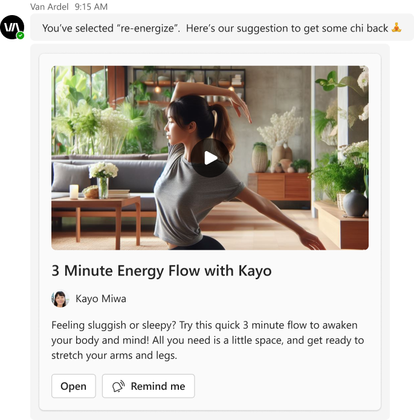
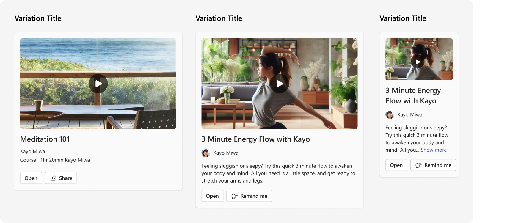

# Static Video

## Summary

Design for showcasing a single static video (does not play inline in the card). The idea is to focus on the video image with a description and action to view. A "play" button graphic has been overlayed on the primary image to help the user quickly identify the card as a video card.

_bot-sent_ card example:





 
## Compatibility


## Adaptive Cards Designer Tool
<!--- button image exported at 1.2x --->
<p>
    <a href="https://adaptivecards.io/designer/index.html?card=https%3A%2F%2Fraw.githubusercontent.com%2Fpnp%2FAdaptiveCards-Templates%2Fmain%2Fsamples%2Femployee-onboarding%2Fac-qv-employee-onboarding.json&data=https%3A%2F%2Fraw.githubusercontent.com%2Fpnp%2FAdaptiveCards-Templates%2Fmain%2Fsamples%2Femployee-onboarding%2Fac-qv-employee-onboarding.data.json">
        
    </a>
</p>

## Solution

Solution|Author(s)
--------|---------
Video | <a href="https://github.com/SuzanneTocco"></a> &nbsp; [Suz Tocco](https://github.com/SuzanneTocco) \| Microsoft  

 

## Version history

Version|Date|Comments
-------|----|--------
1.0| October 31, 2023 | Initial release


## Disclaimer
**THIS CODE IS PROVIDED *AS IS* WITHOUT WARRANTY OF ANY KIND, EITHER EXPRESS OR IMPLIED, INCLUDING ANY IMPLIED WARRANTIES OF FITNESS FOR A PARTICULAR PURPOSE, MERCHANTABILITY, OR NON-INFRINGEMENT.**


## Variations

Information here about typical modifications that are reasonable to this card



## Customize Your Card

This design was created for Teams app partners to support your use case and provides a distinct visual/interaction pattern for this card type to ensure consistency a consistent experience for our users. 

> If you need to modify card elements or adjust layout, use the Teams Adaptive Cards UI Kit (Figma) to draw up the card design.


#### Steps to customize this card with *Adaptive Card Designer* as follows: ####

<details>
<summary>Open Card in Designer</summary>
<p></p>
<p>One- Instructions go here</p>

 `Hello This is a code`
</details>


          
#### Next item ####
- **One** - Insructions go here
- **Two** - Insructions go here about what to do next


 ##  Test Drive Your Card: ##
Info here on how to send card to self and where to test it (desk, mobile). Also checking for how things scale in meeting chat. Basic checklist to cover. Scenarios, light/dark mode

- [ ] Task Area
   - [x] Task Area subtask

## Resources & Tools: ##
- Bullet list
    - Nested bullet
      - Sub-nested bullet etc
- Bullet list item 2 

## Help

We do not support samples, but we this community is always willing to help, and we want to improve these samples. We use GitHub to track issues, which makes it easy for  community members to volunteer their time and help resolve issues.

You can try looking at [issues related to this sample](https://github.com/pnp/AdaptiveCards-Templates/issues) to see if anybody else is having the same issues.


### Card payload

````
{
  "type": "AdaptiveCard",
  "$schema": "http://adaptivecards.io/schemas/adaptive-card.json",
  "version": "1.5",
  "body": [
    {
      "type": "Image",
      "url": "https://raw.githubusercontent.com/suzto/StarterCards/main/samples/video/assets/video_image.png"
    },
    {
      "type": "TextBlock",
      "text": "3 Minute Energy Flow with Kayo",
      "wrap": true,
      "size": "Large",
      "weight": "Bolder"
    },
    {
      "type": "ColumnSet",
      "columns": [
        {
          "type": "Column",
          "width": "auto",
          "items": [
            {
              "type": "Image",
              "url": "https://raw.githubusercontent.com/suzto/StarterCards/main/samples/video/assets/avatar.png",
              "width": "24px",
              "height": "24px",
              "style": "Person"
            }
          ],
          "verticalContentAlignment": "Center"
        },
        {
          "type": "Column",
          "width": "stretch",
          "items": [
            {
              "type": "TextBlock",
              "text": "Kayo Miwa",
              "wrap": true
            }
          ],
          "spacing": "Small",
          "verticalContentAlignment": "Center"
        }
      ]
    },
    {
      "type": "TextBlock",
      "targetWidth": "atLeast:narrow",
      "text": "Feeling sluggish or sleepy? Try this quick 3 minute flow to awaken your body and mind! All you need is a little space, and get ready to stretch your arms and legs.",
      "wrap": true
    },
    {
      "type": "TextBlock",
      "targetWidth": "veryNarrow",
      "text": "Feeling sluggish or sleepy? Try this quick 3 minute flow to awaken your body and...",
      "wrap": true
    },
    {
      "type": "ActionSet",
      "actions": [
        {
          "type": "Action.OpenUrl",
          "title": "Open",
          "url": "https://adaptivecards.io/"
        },
        {
          "type": "Action.OpenUrl",
          "title": "Remind me",
          "url": "https://adaptivecards.io/",
          "iconUrl": "https://raw.githubusercontent.com/suzto/StarterCards/main/samples/video/remind_icon.png"
        }
      ]
    }
  ]
}
````