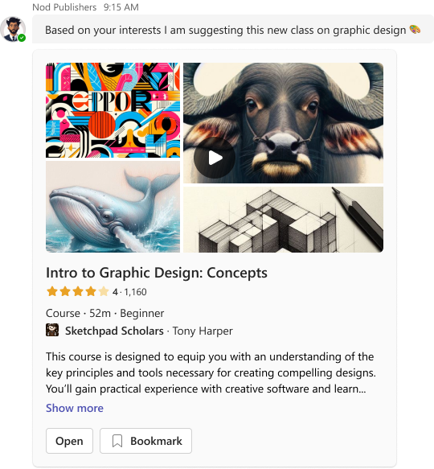
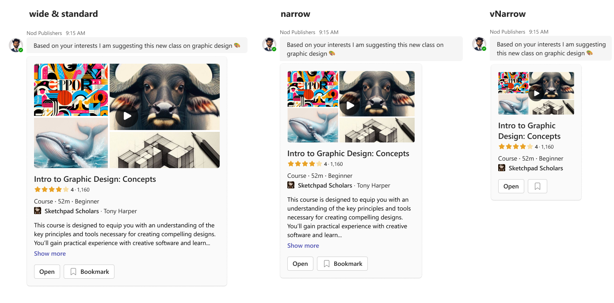

# Course Video

## Summary

This versatile and robust card serves as a learning hub for video content. Tailor it to your specific needs, whether it’s a series of courses, tutorials, or informative clips. Customize titles, descriptions, and author information to create engaging viewing experiences.

_bot-sent_ card example:




## Compatibility


## Solution

Solution|Author(s)
--------|---------
Course Video | <a href="https://github.com/SuzanneTocco"> </a> &nbsp; [Suz Tocco](https://github.com/SuzanneTocco) &nbsp; <a href="https://github.com/pabloas-ms"></a> &nbsp; [Pablo Vicente Astudillo Quintero](https://github.com/pabloas-ms) | Microsoft  


## Version history

Version|Date|Comments
-------|----|--------
1.0| April 11, 2024 | Initial release


#### Disclaimer
***THIS CODE IS PROVIDED *AS IS* WITHOUT WARRANTY OF ANY KIND, EITHER EXPRESS OR IMPLIED, INCLUDING ANY IMPLIED WARRANTIES OF FITNESS FOR A PARTICULAR PURPOSE, MERCHANTABILITY, OR NON-INFRINGEMENT.***


## Design Layouts

This card utilizes our responsive framework, creating multiple layouts or content modifications for specific width ranges. For more details on coding with this framework, see insert msft learn link.



## Inspiration Gallery

lorem ipsum delor amet consectuer leoeian

 
<br/><br/>


## 1) 👩‍🎨 Personalize This Card 


### Step by step instructions and tips: 

  
 #### 1) Open in the Microsoft Teams Designer Editing tool
 This is our ___Teams supported___ tool for building and editing cards.
 
 <a href="https://dev.teams.microsoft.com/home">
        
    </a>
  

#### 2) Replace the image
 Instructions on how to do that go in this space here. Can use sentence or bulletpoints or expand/collapse section


<!--- dropdown --->

<details closed>
<summary>
 Photo and image resources
</summary> <br />

<p>One- Instructions go here about free images</p>
</details>

<!--- dropdown --->

<details closed>
<summary>
 Advanced image editing information
</summary> <br />

<p>One- Instructions go here</p>

</details>  


#### 3) Update the copy and set truncation
 Instructions on how to do that go in this space here. Can use sentence or bulletpoints or expand/collapse section

#### 4) Next steps goes here
 Instructions on how to do that go in this space here. Can use sentence or bulletpoints or expand/collapse section

<p>&nbsp;</p>


__Need more complex design changes?__ Use the Microsoft Teams UI Kit to modify or build on this design <a href="assets/design_spec.png">(detailed spec)</a> and verify the layouts before coding.<br />

<a href="https://www.figma.com/community/file/916836509871353159">

</a> 


### Card Payload

````
{
  "type": "AdaptiveCard",
  "$schema": "http://adaptivecards.io/schemas/adaptive-card.json",
  "version": "1.5",
  "body": [
    {
      "type": "Image",
      "url": "https://raw.githubusercontent.com/suzto/StarterCards/main/samples/video_three/assets/video_image.png",
      "altText": "Web Development Bootcamp Video"
    },
    {
      "type": "TextBlock",
      "text": "Web Development Bootcamp",
      "wrap": true,
      "size": "Large",
      "weight": "Bolder"
    },
    {
      "type": "TextBlock",
      "text": "HackLab Films",
      "wrap": true,
      "spacing": "Small",
      "weight": "Bolder"
    },
    {
      "type": "TextBlock",
      "text": "24m · 17.1M views · 2 months ago",
      "wrap": true,
      "spacing": "None"
    },
    {
      "type": "ActionSet",
      "targetWidth": "atLeast:narrow",
      "actions": [
        {
          "type": "Action.OpenUrl",
          "title": "Open",
          "url": "https://adaptivecards.io/"
        },
        {
          "type": "Action.OpenUrl",
          "title": "Add to calendar",
          "url": "https://adaptivecards.io/",
          "iconUrl": "https://raw.githubusercontent.com/suzto/StarterCards/main/samples/video_three/assets/add_to_calendar_icon.png"
        },
        {
          "type": "Action.OpenUrl",
          "title": "Share in Teams",
          "mode": "secondary",
          "url": "https://adaptivecards.io/",
          "iconUrl": "https://raw.githubusercontent.com/suzto/StarterCards/main/samples/video_three/assets/menu_icon_teams.png"
        },
        {
          "type": "Action.OpenUrl",
          "title": "Download",
          "url": "https://adaptivecards.io/",
          "mode": "secondary",
          "iconUrl": "https://raw.githubusercontent.com/suzto/StarterCards/main/samples/video_three/assets/menu_icon_download.png"
        },
        {
          "type": "Action.OpenUrl",
          "title": "Copy link",
          "mode": "secondary",
          "url": "https://adaptivecards.io/",
          "iconUrl": "https://raw.githubusercontent.com/suzto/StarterCards/main/samples/video_three/assets/menu_icon_link.png"
        }
      ]
    },
    {
      "type": "ActionSet",
      "targetWidth": "veryNarrow",
      "actions": [
        {
          "type": "Action.OpenUrl",
          "title": "Open",
          "url": "https://adaptivecards.io/"
        },
        {
          "type": "Action.OpenUrl",
          "iconUrl": "https://raw.githubusercontent.com/suzto/StarterCards/main/samples/video_three/assets/add_to_calendar_icon.png",
          "url": "https://adaptivecards.io/"
        },
        {
          "type": "Action.OpenUrl",
          "iconUrl": "https://raw.githubusercontent.com/suzto/StarterCards/main/samples/video_three/assets/menu_icon_teams.png",
          "title": "Share in Teams",
          "mode": "secondary",
          "url": "https://adaptivecards.io/"
        },
        {
          "type": "Action.OpenUrl",
          "iconUrl": "https://raw.githubusercontent.com/suzto/StarterCards/main/samples/video_three/assets/menu_icon_download.png",
          "title": "Download",
          "url": "https://adaptivecards.io/",
          "mode": "secondary"
        },
        {
          "type": "Action.OpenUrl",
          "iconUrl": "https://raw.githubusercontent.com/suzto/StarterCards/main/samples/video_three/assets/menu_icon_link.png",
          "title": "Copy link",
          "mode": "secondary",
          "url": "https://adaptivecards.io/"
        }
      ]
    }
  ]
}
````

<!-- 

### Full width Card payload

````
{
  "type": "AdaptiveCard",
  "$schema": "http://adaptivecards.io/schemas/adaptive-card.json",
  "version": "1.5",
  "msTeams": {
    "width": "full"
  },
  "body": [
    {
      "type": "Image",
      "url": "https://raw.githubusercontent.com/suzto/StarterCards/main/samples/video_three/assets/video_image.png",
      "altText": "Web Development Bootcamp Video"
    },
    {
      "type": "TextBlock",
      "text": "Web Development Bootcamp",
      "wrap": true,
      "size": "Large",
      "weight": "Bolder"
    },
    {
      "type": "TextBlock",
      "text": "HackLab Films",
      "wrap": true,
      "spacing": "Small",
      "weight": "Bolder"
    },
    {
      "type": "TextBlock",
      "text": "24m · 17.1M views · 2 months ago",
      "wrap": true,
      "spacing": "None"
    },
    {
      "type": "ActionSet",
      "targetWidth": "atLeast:narrow",
      "actions": [
        {
          "type": "Action.OpenUrl",
          "title": "Open",
          "url": "https://adaptivecards.io/"
        },
        {
          "type": "Action.OpenUrl",
          "title": "Add to calendar",
          "url": "https://adaptivecards.io/",
          "iconUrl": "https://raw.githubusercontent.com/suzto/StarterCards/main/samples/video_three/assets/add_to_calendar_icon.png"
        },
        {
          "type": "Action.OpenUrl",
          "title": "Share in Teams",
          "mode": "secondary",
          "url": "https://adaptivecards.io/"
        },
        {
          "type": "Action.OpenUrl",
          "title": "Download",
          "url": "https://adaptivecards.io/",
          "mode": "secondary"
        },
        {
          "type": "Action.OpenUrl",
          "title": "Copy link",
          "mode": "secondary",
          "url": "https://adaptivecards.io/"
        }
      ]
    },
    {
      "type": "ActionSet",
      "targetWidth": "veryNarrow",
      "actions": [
        {
          "type": "Action.OpenUrl",
          "title": "Open",
          "url": "https://adaptivecards.io/"
        },
        {
          "type": "Action.OpenUrl",
          "iconUrl": "https://raw.githubusercontent.com/suzto/StarterCards/main/samples/video_three/assets/add_to_calendar_icon.png",
          "url": "https://adaptivecards.io/"
        },
        {
          "type": "Action.OpenUrl",
          "iconUrl": "https://raw.githubusercontent.com/suzto/StarterCards/main/samples/video_three/assets/add_to_calendar_icon.png",
          "title": "Share in Teams",
          "mode": "secondary",
          "url": "https://adaptivecards.io/"
        },
        {
          "type": "Action.OpenUrl",
          "iconUrl": "https://raw.githubusercontent.com/suzto/StarterCards/main/samples/video_three/assets/menu_icon_download.png",
          "title": "Download",
          "url": "https://adaptivecards.io/",
          "mode": "secondary"
        },
        {
          "type": "Action.OpenUrl",
          "iconUrl": "https://raw.githubusercontent.com/suzto/StarterCards/main/samples/video_three/assets/add_to_calendar_icon.png",
          "title": "Copy link",
          "mode": "secondary",
          "url": "https://adaptivecards.io/"
        }
      ]
    }
  ]
}
````  -->


## Resources & Tools ##
 

- __Learn__: For complete details on how to design and build adaptive cards for your Teams app, visit the Microsoft Teams Learn website pages on  [Design Adaptive Cards for Your Teams App](https://learn.microsoft.com/en-us/microsoftteams/platform/task-modules-and-cards/cards/design-effective-cards?tabs=design) and [Build Cards](https://learn.microsoft.com/en-us/microsoftteams/platform/task-modules-and-cards/what-are-cards) (You can use the [schema explorer](https://adaptivecards.io/explorer/) to learn about the structure and options of each element.


- __Design__: Our tools can help you learn Teams patterns and design apps and cards.

  - Design Teams apps and cards with the [The Microsoft Teams UI Kit](https://www.figma.com/community/file/916836509871353159), which has core components, templates, and best practices.
  - Find Microsoft icons from [IconCloud](https://iconcloud.design/browse/Fluent%20System%20Library/Fluent%20Regular) or the [Fluent 2 Iconography site](https://fluent2.microsoft.design/iconography) and use them in your cards. You can also use the [Card Designer Icon Set](https://learn.microsoft.com/en-us/sharepoint/dev/spfx/viva/get-started/fluent-icons-limitations#card-designer-icons-set) which is fully supported.


- __Build__: Edit, build, preview, and test cards with our Teams Development Portal [Adaptive Card Designer](https://dev.teams.microsoft.com/cards).
    
</p>


## Contribute ##
Refer to the [contribution docs](/CONTRIBUTE.md) for more information.


## Help

We do not support samples, but we this community is always willing to help, and we want to improve these samples. We use GitHub to track issues, which makes it easy for  community members to volunteer their time and help resolve issues.

You can try looking at [issues related to this sample](https://github.com/pnp/AdaptiveCards-Templates/issues) to see if anybody else is having the same issues.
