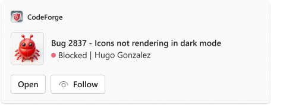
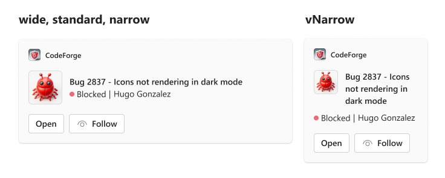

# Work Item Thumbnail

## Summary
The <b>Work Item Thumbnail Card</b> boasts a sleek design with a small image, perfectly suited for concise and straightforward information presentation.


_user-sent_ card example:




## Compatibility


## Solution

Solution|Author(s)
--------|---------
Course Video | <a href="https://github.com/SuzanneTocco"></a> &nbsp; [Suz Tocco](https://github.com/SuzanneTocco) &nbsp;<a href="https://github.com/pabloas-ms"></a> &nbsp; [Pablo Vicente Astudillo Quintero](https://github.com/pabloas-ms) | Microsoft  

## Version history

Version|Date|Comments
-------|----|--------
1.0| April 11, 2024 | Initial release

### Disclaimer

***THIS CODE IS PROVIDED _AS IS_ WITHOUT WARRANTY OF ANY KIND, EITHER EXPRESS OR IMPLIED, INCLUDING ANY IMPLIED WARRANTIES OF FITNESS FOR A PARTICULAR PURPOSE, MERCHANTABILITY, OR NON-INFRINGEMENT.***

## Responsive Layouts

This card utilizes our responsive framework, allowing for multiple layouts or content modifications for specific set width ranges. For more details on coding with this framework, see <a href="https://learn.microsoft.com/en-us/microsoftteams/platform/task-modules-and-cards/cards/cards-format?tabs=adaptive-md%2Cdesktop%2Cconnector-html#adaptive-card-responsive-layout">Design responsive Adaptive Cards</a>.




<br><br><br><br><br>


<a href="https://adaptivecards.io/designer?card=https%3A%2F%2Fraw.githubusercontent.com%2Fsuzto%2FStarterCards%2Fmain%2Fsamples%2Fwork_item%2Fcard.json"  target="_blank">
  
</a>

> [!NOTE]
> Responsive layout is not supported in the Designer.

### Card Payload

```json
{
  "type": "AdaptiveCard",
  "speak": "Bug 2837, icons not rendering in dark mode",
  "$schema": "http://adaptivecards.io/schemas/adaptive-card.json",
  "version": "1.5",
  "body": [
    {
      "type": "ColumnSet",
      "columns": [
        {
          "type": "Column",
          "width": "auto",
          "items": [
            {
              "type": "Image",
              "url": "https://raw.githubusercontent.com/suzto/StarterCards/main/samples/work_item/assets/thumb_image.png",
              "width": "56px",
              "height": "56px",
              "altText": "Logo"
            }
          ]
        },
        {
          "type": "Column",
          "width": "stretch",
          "items": [
            {
              "type": "TextBlock",
              "text": "Bug 2837 - Icons not rendering in dark mode",
              "wrap": true,
              "weight": "Bolder"
            },
            {
              "type": "ColumnSet",
              "targetWidth": "atLeast:narrow",
              "columns": [
                {
                  "type": "Column",
                  "width": "auto",
                  "items": [
                    {
                      "type": "Image",
                      "url": "https://raw.githubusercontent.com/suzto/StarterCards/main/samples/work_item/assets/circle.png",
                      "width": "8px",
                      "height": "8px",
                      "altText": "Red circle"
                    }
                  ],
                  "horizontalAlignment": "Center",
                  "verticalContentAlignment": "Center"
                },
                {
                  "type": "Column",
                  "width": "auto",
                  "items": [
                    {
                      "type": "TextBlock",
                      "text": "Blocked",
                      "wrap": true
                    }
                  ],
                  "spacing": "Small",
                  "verticalContentAlignment": "Center"
                },
                {
                  "type": "Column",
                  "width": "auto",
                  "items": [
                    {
                      "type": "TextBlock",
                      "text": "|",
                      "wrap": true
                    }
                  ],
                  "spacing": "Small",
                  "verticalContentAlignment": "Center"
                },
                {
                  "type": "Column",
                  "width": "auto",
                  "items": [
                    {
                      "type": "TextBlock",
                      "text": "Hugo Gonzalez",
                      "wrap": true
                    }
                  ],
                  "spacing": "Small",
                  "verticalContentAlignment": "Center"
                }
              ]
            }
          ]
        }
      ]
    },
    {
      "type": "ColumnSet",
      "targetWidth": "atLeast:narrow",
      "columns": [
        {
          "type": "Column",
          "width": "auto",
          "items": [
            {
              "type": "Image",
              "url": "https://raw.githubusercontent.com/suzto/StarterCards/main/samples/work_item/assets/circle.png",
              "width": "8px",
              "height": "8px",
              "altText": "Red circle"
            }
          ],
          "horizontalAlignment": "Center",
          "verticalContentAlignment": "Center"
        },
        {
          "type": "Column",
          "width": "auto",
          "items": [
            {
              "type": "TextBlock",
              "text": "Blocked",
              "wrap": true
            }
          ],
          "spacing": "Small",
          "verticalContentAlignment": "Center"
        },
        {
          "type": "Column",
          "width": "auto",
          "items": [
            {
              "type": "TextBlock",
              "text": "|",
              "wrap": true
            }
          ],
          "spacing": "Small",
          "verticalContentAlignment": "Center"
        },
        {
          "type": "Column",
          "width": "auto",
          "items": [
            {
              "type": "TextBlock",
              "text": "Hugo Gonzalez",
              "wrap": true
            }
          ],
          "spacing": "Small",
          "verticalContentAlignment": "Center"
        }
      ]
    },
    {
      "type": "ActionSet",
      "actions": [
        {
          "type": "Action.OpenUrl",
          "title": "Open",
          "url": "https://adaptivecards.io/"
        },
        {
          "type": "Action.Submit",
          "title": "Follow",
          "iconUrl": "https://raw.githubusercontent.com/suzto/StarterCards/main/samples/work_item/assets/follow_icon.png"
        }
      ]
    }
  ]
}
```

### Full width Card payload

````
{
  "type": "AdaptiveCard",
  "msTeams": {
    "width": "full"
  },
  "$schema": "http://adaptivecards.io/schemas/adaptive-card.json",
  "version": "1.5",
  "body": [
    {
      "type": "ColumnSet",
      "columns": [
        {
          "type": "Column",
          "width": "auto",
          "items": [
            {
              "type": "Image",
              "url": "https://raw.githubusercontent.com/suzto/StarterCards/main/samples/work_item/assets/thumb_image.png",
              "width": "56px",
              "height": "56px",
              "altText": "Logo"
            }
          ]
        },
        {
          "type": "Column",
          "width": "stretch",
          "items": [
            {
              "type": "TextBlock",
              "text": "Bug 2837 - Icons not rendering in dark mode",
              "wrap": true,
              "weight": "Bolder"
            },
            {
              "type": "ColumnSet",
              "targetWidth": "atLeast:narrow",
              "columns": [
                {
                  "type": "Column",
                  "width": "auto",
                  "items": [
                    {
                      "type": "Image",
                      "url": "https://raw.githubusercontent.com/suzto/StarterCards/main/samples/work_item/assets/circle.png",
                      "width": "8px",
                      "height": "8px",
                      "altText": "Red circle"
                    }
                  ],
                  "horizontalAlignment": "Center",
                  "verticalContentAlignment": "Center"
                },
                {
                  "type": "Column",
                  "width": "auto",
                  "items": [
                    {
                      "type": "TextBlock",
                      "text": "Blocked",
                      "wrap": true
                    }
                  ],
                  "spacing": "Small",
                  "verticalContentAlignment": "Center"
                },
                {
                  "type": "Column",
                  "width": "auto",
                  "items": [
                    {
                      "type": "TextBlock",
                      "text": "|",
                      "wrap": true
                    }
                  ],
                  "spacing": "Small",
                  "verticalContentAlignment": "Center"
                },
                {
                  "type": "Column",
                  "width": "auto",
                  "items": [
                    {
                      "type": "TextBlock",
                      "text": "Hugo Gonzalez",
                      "wrap": true
                    }
                  ],
                  "spacing": "Small",
                  "verticalContentAlignment": "Center"
                }
              ]
            }
          ]
        }
      ]
    },
    {
      "type": "ColumnSet",
      "targetWidth": "atLeast:narrow",
      "columns": [
        {
          "type": "Column",
          "width": "auto",
          "items": [
            {
              "type": "Image",
              "url": "https://raw.githubusercontent.com/suzto/StarterCards/main/samples/work_item/assets/circle.png",
              "width": "8px",
              "height": "8px",
              "altText": "Red circle"
            }
          ],
          "horizontalAlignment": "Center",
          "verticalContentAlignment": "Center"
        },
        {
          "type": "Column",
          "width": "auto",
          "items": [
            {
              "type": "TextBlock",
              "text": "Blocked",
              "wrap": true
            }
          ],
          "spacing": "Small",
          "verticalContentAlignment": "Center"
        },
        {
          "type": "Column",
          "width": "auto",
          "items": [
            {
              "type": "TextBlock",
              "text": "|",
              "wrap": true
            }
          ],
          "spacing": "Small",
          "verticalContentAlignment": "Center"
        },
        {
          "type": "Column",
          "width": "auto",
          "items": [
            {
              "type": "TextBlock",
              "text": "Hugo Gonzalez",
              "wrap": true
            }
          ],
          "spacing": "Small",
          "verticalContentAlignment": "Center"
        }
      ]
    },
    {
      "type": "ActionSet",
      "actions": [
        {
          "type": "Action.OpenUrl",
          "title": "Open",
          "url": "https://adaptivecards.io/"
        },
        {
          "type": "Action.Submit",
          "title": "Follow",
          "iconUrl": "https://raw.githubusercontent.com/suzto/StarterCards/main/samples/work_item/assets/follow_icon.png"
        }
      ]
    }
  ]
}
````
